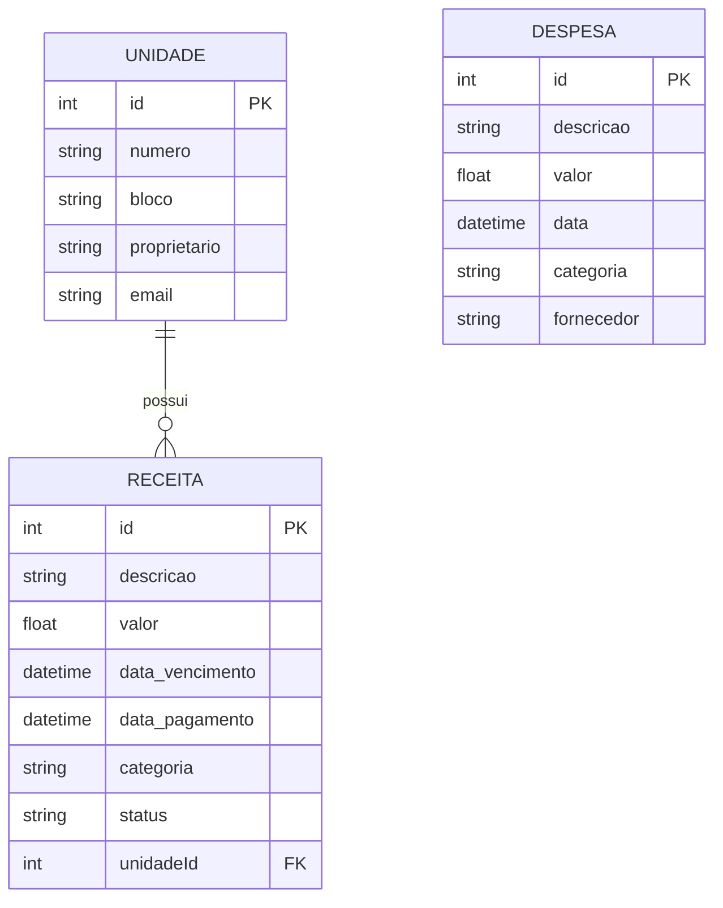

# Modelo de Dados

## Entidades

### Unidade

Representa uma unidade habitacional/comercial do condomínio.

| Campo | Tipo | Descrição |
|-------|------|-----------|
| id | Int (PK) | Identificador único |
| numero | String | Número da unidade (ex: "101") |
| bloco | String | Bloco ou torre |
| proprietario | String | Nome do proprietário |
| email | String | Email de contato |

### Receita

Toda entrada financeira do condomínio.

| Campo | Tipo | Descrição |
|-------|------|-----------|
| id | Int (PK) | Identificador único |
| descricao | String | Descrição da receita |
| valor | Float | Valor |
| data_vencimento | DateTime | Data de vencimento |
| data_pagamento | DateTime? | Data de pagamento (null se pendente) |
| unidadeId | Int (FK) | Unidade pagadora |
| categoria | String | Categoria (condomínio, multa, juros, outro) |
| status | String | pago / pendente / atrasado |

### Despesa

Toda saída financeira do condomínio.

| Campo | Tipo | Descrição |
|-------|------|-----------|
| id | Int (PK) | Identificador único |
| descricao | String | Descrição da despesa |
| valor | Float | Valor |
| data | DateTime | Data da despesa |
| categoria | String | Categoria (agua, luz, folha, manutencao, etc) |
| fornecedor | String | Nome do fornecedor/prestador |

## Diagrama ER

## Relacionamentos

- **Unidade 1:N Receita** — Uma unidade pode ter várias receitas (mensalidades)
- **Despesa** é independente (despesas do condomínio como um todo, não por unidade)
